

Welcome to my AI art page, where I explore the fascinating world of style transfer. Using cutting-edge artificial intelligence technology, I have transformed ordinary photos into extraordinary works of art, each with their own unique style and personality.

# AI Artistry: Transforming Reality Through Style Transfer

## Raw Image

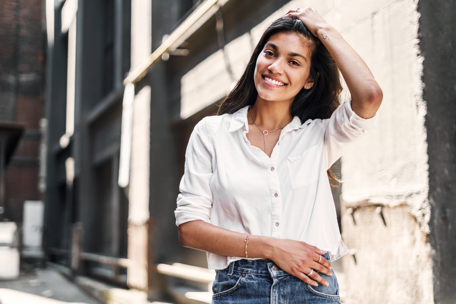

Image source: https://burst.shopify.com/photos/smiling-woman-poses

## Raw :arrow_right: 2.5D Image

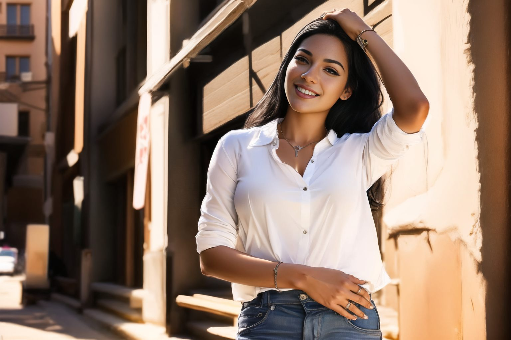

## Raw :arrow_right: Altered Scenery

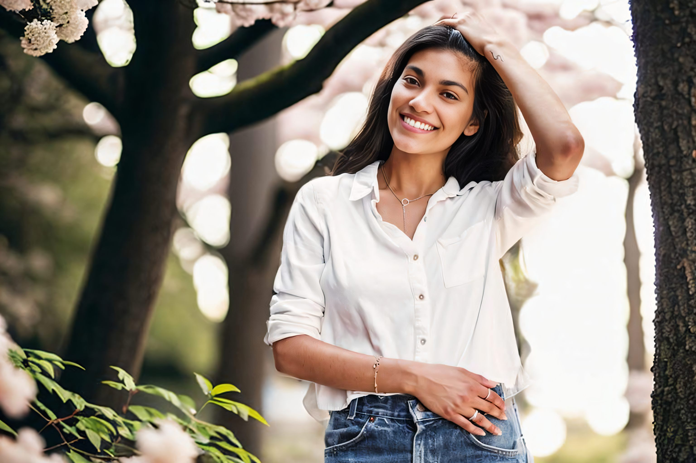

## Raw :arrow_right: Watercolor Painting

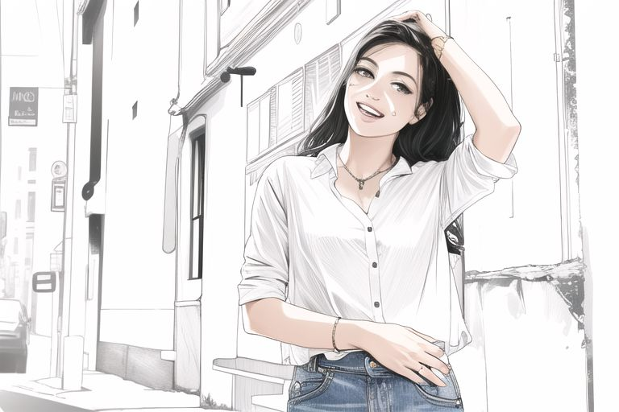

## Raw :arrow_right: Pencil Sketch

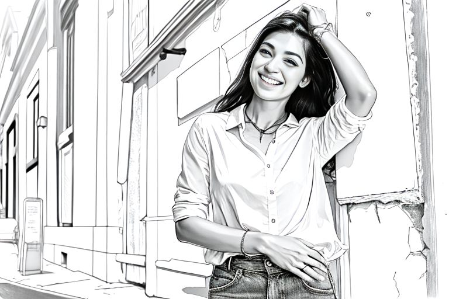

## Raw :arrow_right: Comicbook Style

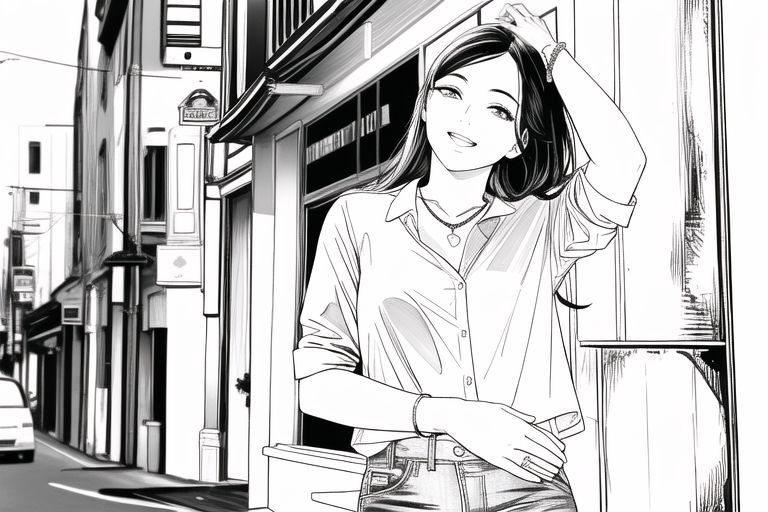

## Raw :arrow_right: Transposed Persona

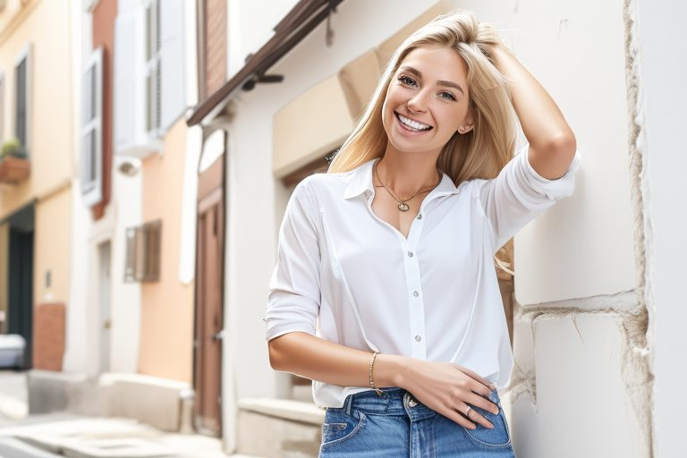

## Raw :arrow_right: Van Gogh-inspired Blend

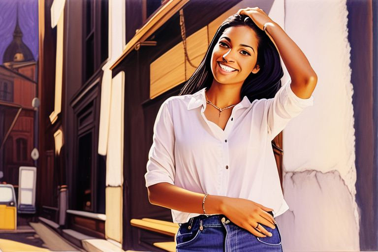

# Bringing Sketch to Life

## Sketch

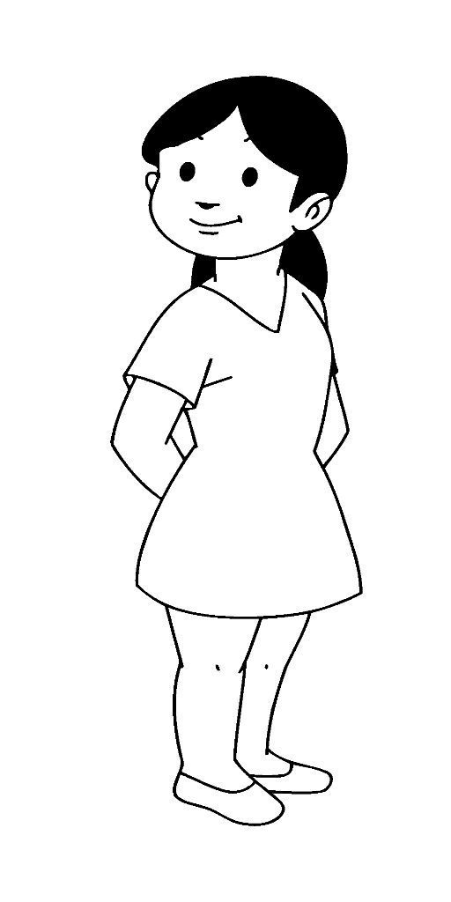

Image source: https://www.supercoloring.com/coloring-pages/child-line-drawing

## Sketch :arrow_right: Colorful Cartoon Creation

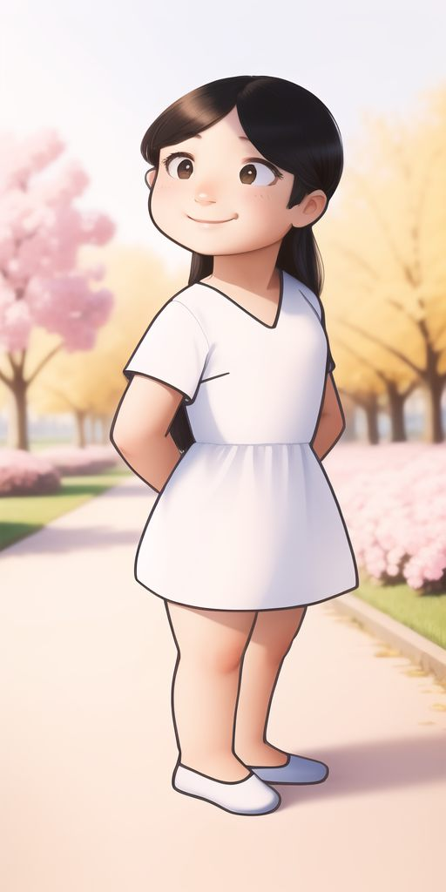

# Reviving the Past: A Modern Take on a Vintage Classic

## Vintage Photo

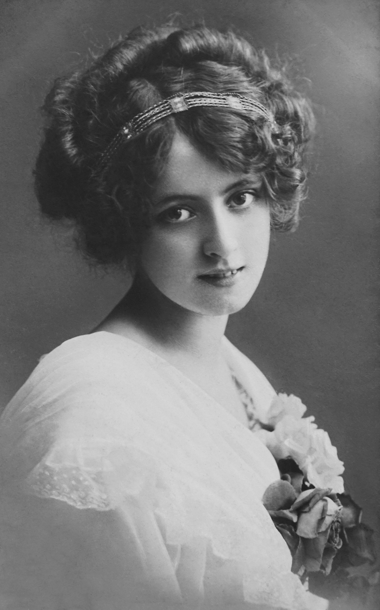

Image source: https://www.pexels.com/photo/grayscale-photography-of-a-beautiful-woman-in-white-dress-3571303/

## Vintage Photo :arrow_right: Full Colour

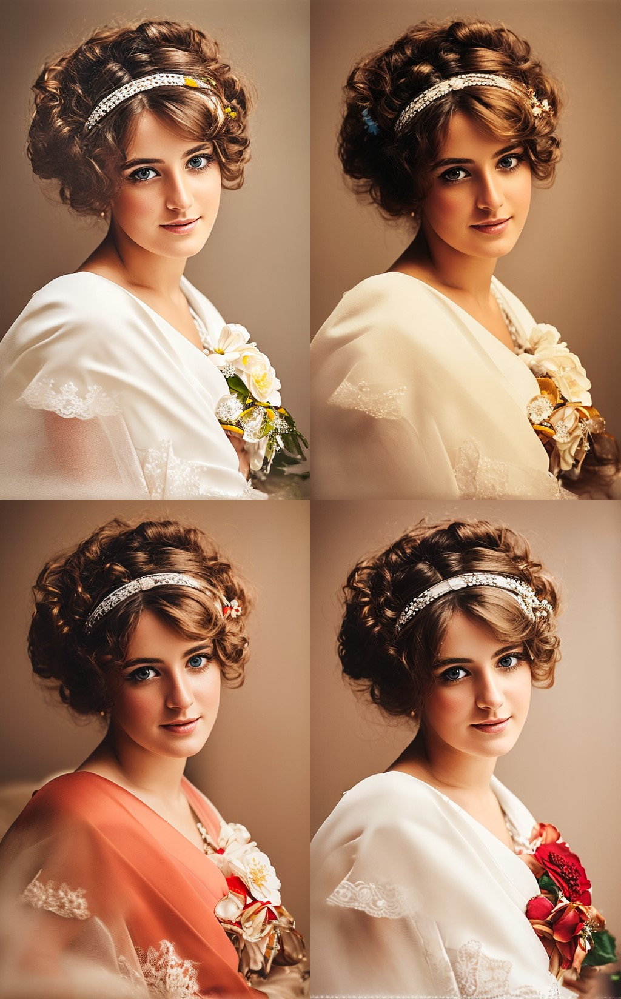

## Virtual Reality Blend

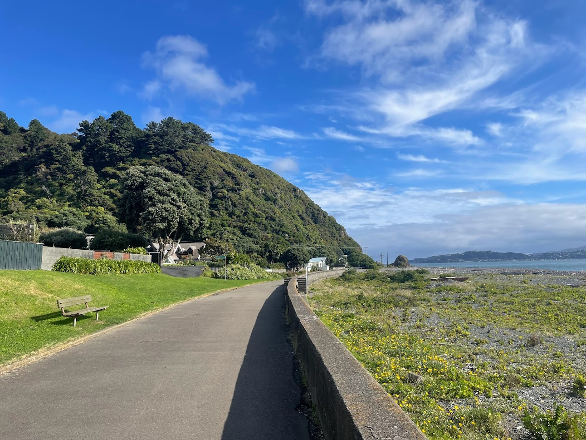
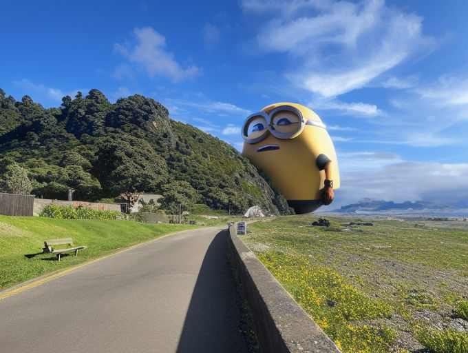
  
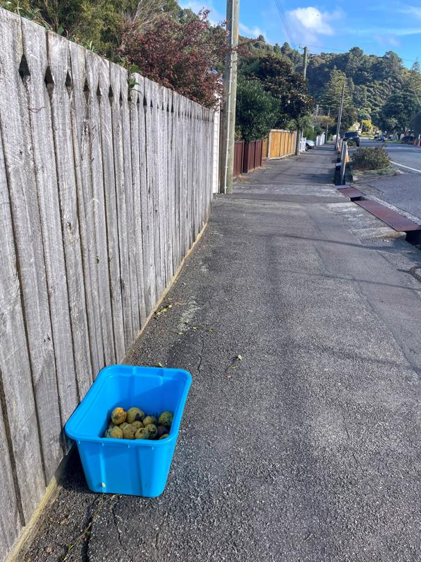
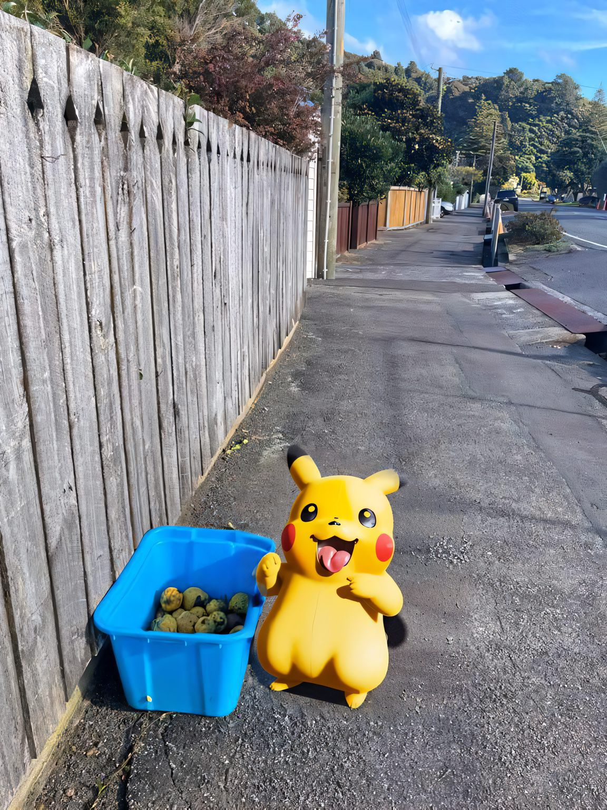

# Support My Artwork

